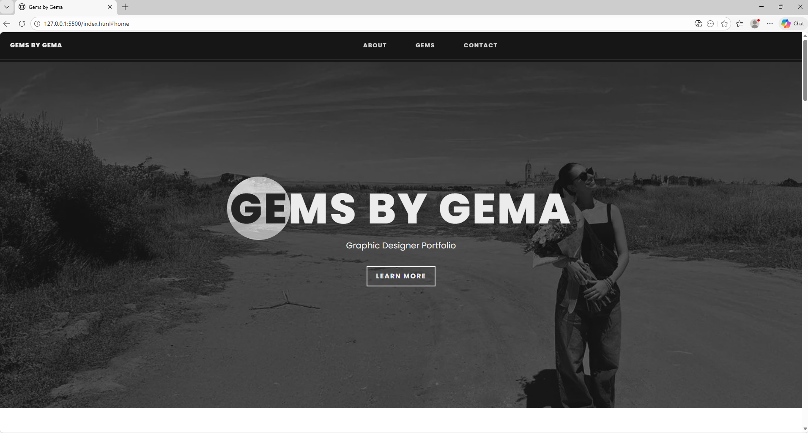
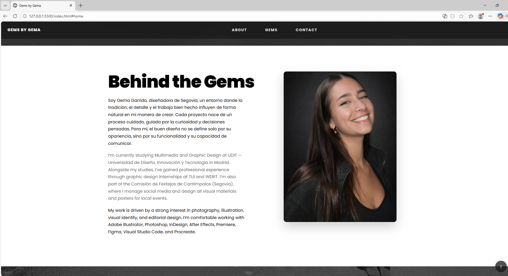
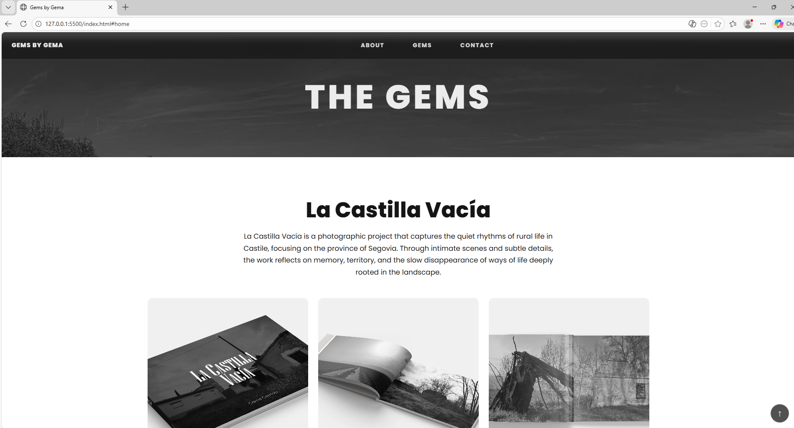
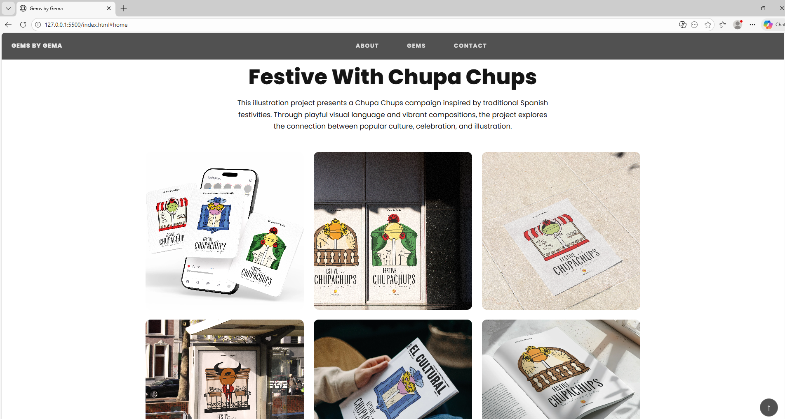
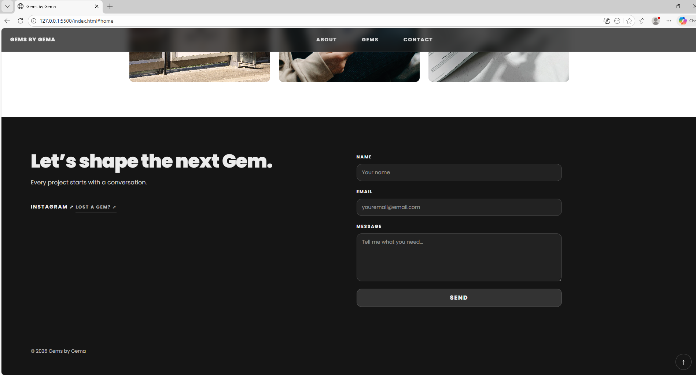
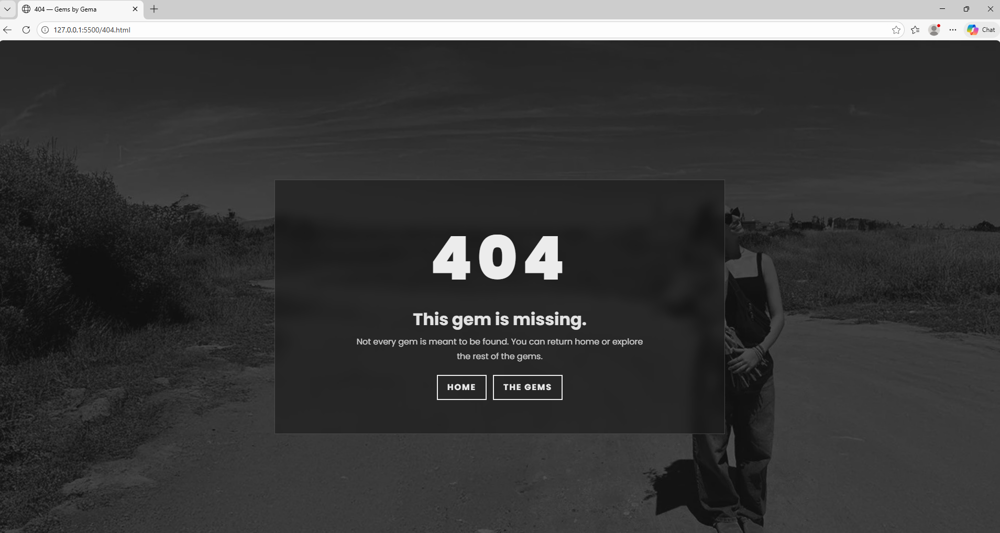

# Mi Portfolio molon

by Gema Garrido

[https://gemagarrido.github.io/Portfolio/] (https://gemagarrido.github.io/Portfolio/)

https://gemagarrido.github.io/Portfolio/

# Gems by Gema — Portfolio Web (Nivel 2)

Portfolio web personal desarrollado como proyecto académico. El sitio presenta una selección de proyectos creativos bajo una estética editorial y minimalista, y funciona como carta de presentación profesional.

---

## Descripción y propósito del proyecto

El objetivo de este proyecto es diseñar y desarrollar un portfolio web responsive que refleje una identidad visual coherente y profesional. El sitio reúne proyectos de fotografía, 3D e ilustración, y facilita el contacto con posibles clientes o colaboradores.

El diseño se basa en una estética monocromática, una composición clara y un uso cuidado de la tipografía, priorizando la experiencia de usuario y la accesibilidad.

---

## Stack tecnológico utilizado

- HTML5
- CSS3 (arquitectura modular: base, layout, components, otros)
- JavaScript (ES6)
- Bootstrap 5 (navegación responsive con menú hamburguesa)
- GSAP + ScrollTrigger (animaciones on scroll)
- ImageKit (optimización y carga de imágenes)

---

## Instrucciones de configuración para desarrollo local

1. Clonar el repositorio:

   ```bash
   git clone https://github.com/gemagarrido/Portfolio.git

   ```

2. Abrir el proyecto en Visual Studio Code (o editor similar)

3. Ejecutar con Live Server o cualquier servidor local

## Guía de personalización

Textos y estructura: index.html

Estilos: carpeta /assets/css

Animaciones y lógica: assets/js/main.js

Imágenes: servidas desde ImageKit (URLs en el HTML)

Página 404: 404.html + assets/css/404.css

## Capturas de pantalla

### Home



### Behind the Gems



### The Gems





### Contact



### Página 404



## Uso de Inteligencia Artificial

Durante el desarrollo de este proyecto se ha utilizado un asistente de inteligencia artificial (ChatGPT) como herramienta de apoyo.

El uso de IA ha seguido el flujo en dos fases indicado en el briefing del curso:

Fase 1 — Planificación
La IA se utilizó para solicitar planes de desarrollo, propuestas de estructura y enfoques técnicos antes de comenzar la implementación.

Fase 2 — Implementación
Tras documentar los planes generados, la implementación del código se realizó manualmente, adaptando y ajustando las propuestas a las necesidades específicas del proyecto.

La documentación detallada de cada planificación se encuentra en la carpeta /docs, con un archivo de plan independiente por cada feature o tarea (plan1.md, plan2.md, plan3.md).

## Créditos y agradecimientos

Diseño y desarrollo: Gema Garrido

Tipografía: Google Fonts — Poppins

Animaciones: GSAP

Asistencia técnica: ChatGPT (OpenAI)
